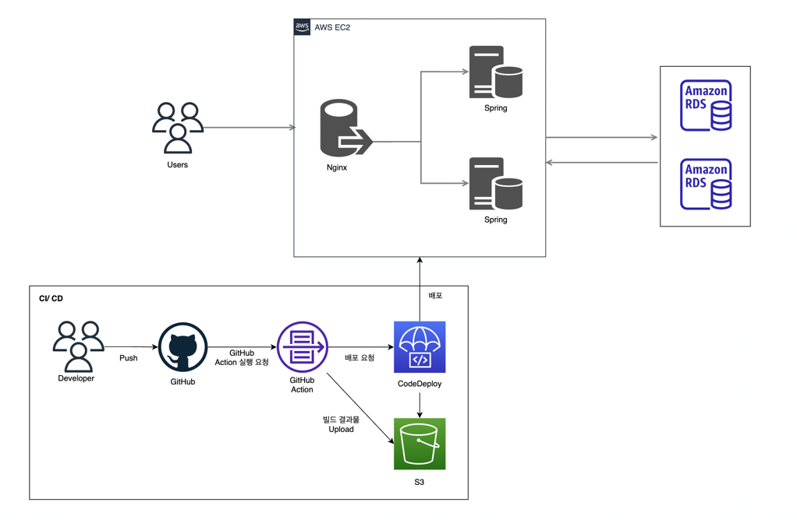

### My Pet

반려 동물의 일상을 공유하는 서비스입니다.

- 살펴보기 : https://my-pet.o-r.kr
- API 명세서 : https://my-pet.o-r.kr/api

### ✅ 프로젝트 목표

- 단순한 기능 구현이 아닌 대규모 트래픽에서도 장애를 최소화하여 안정적인 서비스를 제공
- UI는 카카오 오븐으로 대체하여 REST API 서버만 구성

### ✅ 기술 스택

- Back-End
    - Java 17
    - Spring Boot v3.0.2
    - Spring Data JPA v3.0.1
- Infra
    - AWS EC2
    - AWS RDS
    - AWS S3
    - AWS CodeDeploy
- ETC
    - Spring Rest Docs
    - GitHub Actions

### ✅ 아키텍쳐

